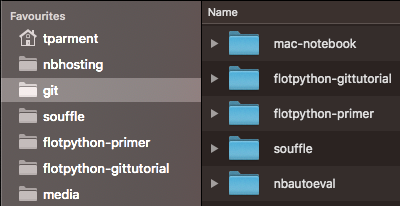

# `mac-notebook`

## Purpose

This repo contains a utility to ease the workflow of opening jupyter notebooks on a macOS box.

In a nutshell, the purpose is to

* be able to open any notebook (or directory) under your home directory, in a jupyter classic notebook, from the command line; the tool will spawn a jupyter server as needed;
* with a little more care, be able to double click on a notebook to achieve the same result;
* this all assumes you have a `base` conda env to use for all your notebooks; an implicit mapping is performed to find out a more relevant/specific conda env to use for notebooks in a given project.

## conda envs

The tool has a builtin feature for dealing with (mini)conda envs. The challenge here
is that when you double click on a notebook in your finder, there is no way you
can describe in what conda env you want this to happen.

So our approach relies on the following convention:

* create conda envs that are named after a directory in the path to your notebooks
* if such a conda env is found, use it, otherwise use `base` 

### Example



Assume the filesystem layout depicted above, and that you have 

```bash
$ conda env list
# conda environments:
#
base                     /Users/tparment/miniconda3
flotpython-gittutorial  *  /Users/tparment/miniconda3/envs/flotpython-gittutorial
flotpython-primer        /Users/tparment/miniconda3/envs/flotpython-primer
nbhosting                /Users/tparment/miniconda3/envs/nbhosting
r2lab-demos              /Users/tparment/miniconda3/envs/r2lab-demos
```

* then clicking in any notebook under `~/git/flotpython-tutorial` will run inside the `flotpython-tutorial` conda env, 
* while any notebook under `~/git/nbautoeval` will end up running in the `base` conda env


### Expectations, and convention about `nbextensions`

There are a few additional assumptions made by the system:

* when a conda env is found, it must also - of course - have `jupyter` installed locally; a warning is issued otherwise and this env is not used
* when no suitable `venv` can be found, then the notebook is opened inside the `base` conda env; as of this writing this means that `mac-notebook` might not work without miniconda installed 
* conda envs are searched in `~/miniconda3/envs` 

**NOTE:** as of now, installation is **not** automated, follow instruction
*below.

## Usage

Once installed (see below), from a terminal you just run:

* `macnb-open` to open current directory
* `macnb-open mynotebook.ipynb` to open a notebook
* `macnb-open nb1 nb2.ipynb` to open several notebooks
* `macnb-all` displays all jupyter servers running on that box
* `macnb-list` displays the jupyter server for local virtualenv, if running
* `macnb-kill` allows to kill that server; you may pass a filename that will be used to spot a specific jupyter server

## Installation

You need to create symlinks in your `PATH`; for example (tweak according to your needs):

```
cd ~/git
git clone https://github.com/parmentelat/mac-notebook.git
ln -sf ~/git/mac-notebook/bin/macnb-bashrc /usr/local/bin
for name in macnb-open macnb-list macnb-all macnb-kill; do
    sudo ln -sf ~/git/mac-notebook/bin/macnb /usr/local/bin/$name
done
```

## Finder: create a macOS app

Using Automator, you can easily create a native macOS application that wraps
`macnb-open`, and so have double-clicking on a `ipynb` file trigger this
function.

Under automator:

* create an `Application`
* add an action `Run shell script`
* change `Pass input:` to `as arguments`
* then replace the script with (assuming you installed in `/usr/local/bin`)

```
/usr/local/bin/macnb-open "$@" &
```

* save the application in `/Applications/mac-notebook`

## Finder - bind mouse clicks on .ipynb files

From that point, you can select this application from the finder:

* right-click on a `.ipynb` file, select `Get Info`
* in the `Open with` area, select this newly created `mac-notebook` application,
* optionally select `'Change All'` if you want this mapping to apply on all `ipynb` files.

## Finder - attach jupyter icon to that app

It's nicer if your app shows the jupyter logo:

```
cp ~/git/mac-notebook/mac-notebook.icns /Applications/mac-notebook.app/Contents/Resources/AutomatorApplet.icns
```

**Devel note:** For the record, the way to generate the `.icns` file was:

* from icon/jupyter-logo-transparent.png, extract a square portion
* create the 10 variants of sizes in `icon.iconset` with these exact names
* run `iconutil --convert icns -o mac-notebook.icns icon.iconset/`
